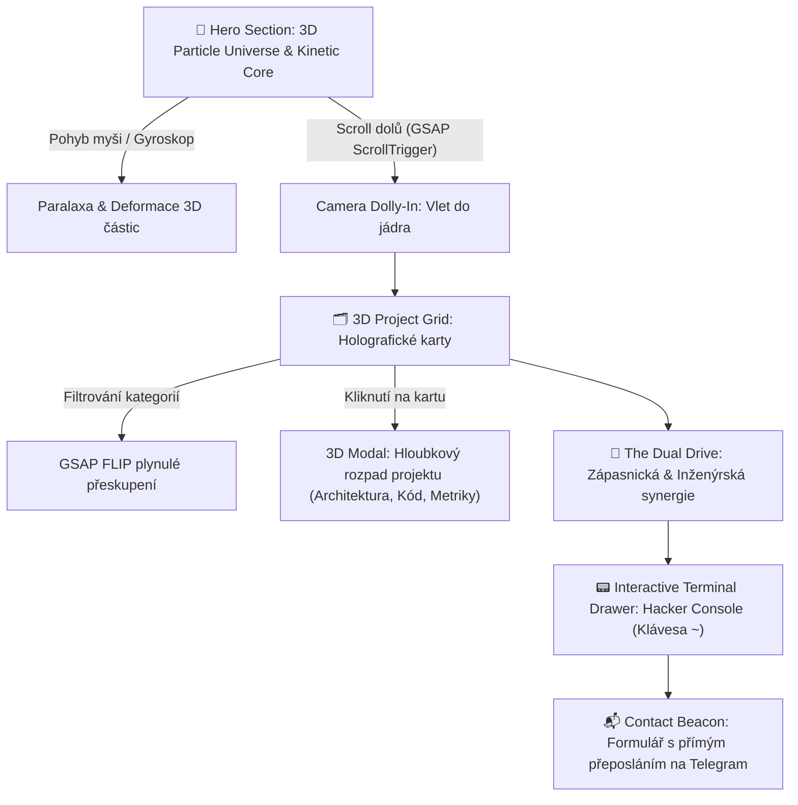

# 🌌 ARCHITECTURE.md — 3D Cyber-Portfolio & Kinetic Showcase

> **Projekt:** Interaktivní 3D osobní webové portfolio  
> **Autor:** Jakub Sedlák (`kubkic-code`)  
> **Cíl:** Prezentovat projekty (Web Scraping, AI, Automatizace, Finanční analytika, IoT Hardware) ve formě špičkového, pohlcujícího 3D zážitku.  
> **Stack:** Python (Flask) • Vanilla HTML5/CSS3/ES6+ • Three.js (WebGL) • GSAP (ScrollTrigger) • Docker  

---

## 1. 🎨 Kreativní koncept: "The Cybernetic Forge / Kinetic Node Universe"

Web není pouhý statický seznam odkazů, ale **živý digitální organismus**, který spojuje dva klíčové pilíře autorova profilu:
1. **Vrcholový sport (Řecko-římský zápas):** Síla, dynamika, disciplína, tah na branku, schopnost jít na hranu možností.
2. **Technologický inženýring:** Automatizace nudné práce, reverzní inženýrství, scraping pod 1 sekundu, AI integrace a hardware.

### 🌟 Vizuální Atmosféra & Styl
- **Barevná paleta (Deep Space OLED):**
  - Základní pozadí: Hluboká vesmírná černá `#08090D` a tmavá ocel `#0F131C`.
  - Neonové akcenty: Cyber Indigo (`#6366F1`), Quantum Cyan (`#06B6D4`), Emerald Signal (`#10B981`) a Amber Warning (`#F59E0B`).
  - Efekty: Glassmorphism s matným rozostřením (`backdrop-filter: blur(16px)`), holografické linky a specular odlesky při pohybu myši.
- **Typografie:** Moderní geometrický sans-serif font (např. *Outfit* nebo *Space Grotesk* pro nadpisy, *JetBrains Mono* pro kód a technické tagy, *Inter* pro tělo textu).

---

## 2. 🎬 Uživatelský průchod & 3D Interaktivita (Experiential Journey)



### Sekce 1: Hero — 3D Particle Universe & Cyber-Core
- **Three.js Plátno na celou obrazovku:**
  - V prostoru rotuje **3D krystalické geometrické těleso** (např. mnohostěn / Icosahedron obklopený tisíci plovoucími částicemi).
  - **Reakce na kurzor:** Pohyb myši naklání kameru a vytváří gravitační vlny v částicovém poli (částice se vyhýbají kurzoru a pomalu se vrací).
  - **Dynamic Badge & Typing Text:** *"Jakub Sedlák • Code. Automate. Compete."* s jemným holografickým třpytem.
  - **Custom Magnetický Kurzor:** Kruhový kurzor s plynulým dojezdem, který se magneticky přitahuje k tlačítkům a interaktivním kartám.

### Sekce 2: Project Matrix — Holografické karty s GSAP ScrollTrigger
- Při scrollování provede Three.js kamera plynulý **Dolly-Zoom (průlet částicovým polem)** a dostane návštěvníka k mřížce projektů.
- Projekty se nevynořují ploše:
  - Využívají **3D Tilt efekt:** Karta se naklání podle pozice kurzoru (reálný 3D odlesk světla na skleněném povrchu).
  - **GSAP ScrollTrigger Stagger:** Karty kaskádovitě vystupují z hloubky osy Z (`translateZ`), přičemž se aktivují jejich neonové bordery.
- **Kategorické přepínače (Filter Bar):**
  - Všechny projekty • AI & Finanční data • Web Scraping & Arbitráž • Automatizace & Boti • IoT Hardware • Web & UI/UX.
  - Při změně kategorie se karty nerozblikají, ale plynule přeskupí pomocí **GSAP FLIP (First Last Invert Play)** animace.

### Sekce 3: Projektový Holo-Inspector (Interaktivní detail)
- Po kliknutí na kartu projekt neopouští stránku do nudného GitHubu:
  - Otevře se **3D Glassmorphism modal**, který obsahuje:
    - Systémový diagram (Mermaid nebo vizuální schéma).
    - Klíčové metriky (např. *Rychlost: 0.6s*, *RAM: <120 MB*, *Modely: DCF/Graham*).
    - Seznam technologií a přímé odkazy na kód.

### Sekce 4: "The Dual Drive" (Filozofie & Životní styl)
- Vizuální interaktivní prvek demonstrující paralelu mezi **vrcholovým zápasem** a **vývojem softwaru**:
  - *Disciplína z žíněnky* = Schopnost psát čistý, odolný kód, který nespadne v produkci.
  - *Rychlost reakce v zápase* = 0.6sekundové arbitráže a bleskové reakce na trhu.

### Sekce 5: Interaktivní Hacker Terminal (Výsuvná konzole)
- Stisknutím klávesy `~` (tilda) nebo kliknutím na ikonu terminálu v rohu vyjede polo-průhledná konzole.
- Umožňuje interakci přes textové příkazy:
  - `help` — seznam příkazů
  - `projects --cat ai` — vyfiltrování AI projektů
  - `cat author.md` — zobrazení bio
  - `matrix` — spuštění zeleného matrix deště v Three.js
  - `contact` — rychlé odeslání zprávy

### Sekce 6: Contact Beacon s přímým Telegram notifikátorem
- Žádný obyčejný e-mailový formulář, který skončí ve spamu.
- Odeslání formuláře přes Flask backend okamžitě vytvoří zprávu a **pošle ji autorovi přes Telegram Bot API přímo do mobilu** s potvrzením o doručení v reálném čase.

---

## 3. 🏗️ Systémová architektura

```
┌─────────────────────────────────────────────────────────────┐
│                      DOCKER CONTAINER                       │
│                                                             │
│  ┌───────────────────────────┐  ┌────────────────────────┐  │
│  │   PYTHON FLASK BACKEND    │  │  PORTFOLIO_DATA.JSON   │  │
│  │  - App Factory            │◄─┼─ (Strukturovaná DB     │  │
│  │  - REST API (/api/*)      │  │   všech 18+ projektů)  │  │
│  │  - Telegram Dispatcher    │  └────────────────────────┘  │
│  │  - Gunicorn WSGI Server   │                              │
│  └─────────────┬─────────────┘                              │
│                │ JSON payloady                              │
│                ▼                                            │
│  ┌───────────────────────────────────────────────────────┐  │
│  │                  FRONTEND (SPA ENGINE)                │  │
│  │                                                       │  │
│  │  ┌──────────────┐  ┌──────────────┐  ┌─────────────┐  │  │
│  │  │   THREE.JS   │  │  GSAP 3.x    │  │ VANILLA UI  │  │  │
│  │  │  - Particles │  │ - Timeline   │  │ - Design Sys│  │  │
│  │  │  - 3D Mesh   │  │ - ScrollTrig │  │ - Glassmorp.│  │  │
│  │  │  - Shaders   │  │ - FLIP Grid  │  │ - Modals    │  │  │
│  │  └──────────────┘  └──────────────┘  └─────────────┘  │  │
│  └───────────────────────────────────────────────────────┘  │
└──────────────────────────────▲──────────────────────────────┘
                               │ HTTP / HTTPS (:5000)
                        ┌──────┴──────┐
                        │   Browser   │
                        └─────────────┘
```

---

## 4. 🐍 Backend architektura (Python Flask)

### Struktura backendových služeb:
1. **`app.py`**:
   - Inicializace Flasku, konfigurace z proměnných prostředí (`.env`).
   - Nastavení CORS, komprese odpovědí (Gzip) a bezpečnostních hlaviček.
2. **`services/data_manager.py`**:
   - Bezpečné načtení a validace `portfolio_data.json` při startu do paměťové cache.
   - Poskytování vyhledávacích metod (`get_all_projects()`, `get_by_category()`, `get_featured()`).
3. **`services/telegram_notifier.py`**:
   - Asynchronní odesílání zpráv z kontaktního formuláře do osobního Telegram chatu.
4. **API Endpointy:**
   - `GET /` — Servíruje hlavní optimalizovanou HTML stránku.
   - `GET /api/data` — Vrací kompletní data o autorovi, kategoriích a projektech.
   - `GET /api/projects` — Vrací seznam projektů (volitelně s filtrem `?category=...` nebo `?tag=...`).
   - `GET /api/projects/<id>` — Vrací detail konkrétního projektu.
   - `GET /api/metrics` — Agregované statistiky (celkový počet projektů, scrapované trhy, hardware jednotky).
   - `POST /api/contact` — Příjem zprávy z kontaktního formuláře, validace a odeslání na Telegram.

---

## 5. 🖥️ Frontend architektura (HTML / CSS / JS)

### 1. Adresářová struktura:
```
portfolio_web/
├── app.py                      # Flask aplikace
├── portfolio_data.json         # Databáze projektů
├── requirements.txt            # Python závislosti
├── Dockerfile                  # Kontejnerizace
├── docker-compose.yml          # Compose konfigurace
│
├── static/
│   ├── css/
│   │   ├── variables.css       # Design tokens (barvy, spacing, neon glow)
│   │   ├── base.css            # Reset, typografie, layout
│   │   ├── components.css      # Karty, tlačítka, odznaky, tagy
│   │   ├── glassmorphism.css   # Skleněné panely, blur efekty
│   │   ├── terminal.css        # Hacker console drawer
│   │   └── responsive.css      # Media queries pro mobil a tablet
│   │
│   ├── js/
│   │   ├── main.js             # Vstupní bod, inicializace modulů
│   │   ├── three-scene.js      # Three.js scéna, částice, 3D krystal, myš
│   │   ├── gsap-animations.js  # GSAP ScrollTrigger, plynulé vynořování
│   │   ├── project-grid.js     # Dynamické renderování karet a FLIP filtr
│   │   ├── modal.js            # Otevírání detailů projektů
│   │   ├── terminal.js         # Interaktivní CLI konzole
│   │   └── contact.js          # Odeslání formuláře přes AJAX na Flask API
│   │
│   └── assets/
│       ├── icons/              # SVG ikony technologií
│       └── images/             # Screenshoty a diagramy projektů
│
└── templates/
    └── index.html              # Sémantická, SEO-optimalizovaná šablona
```

### 2. Three.js Specifikace (3D Engine):
- **Renderer:** `THREE.WebGLRenderer` s `antialias: true` a `powerPreference: "high-performance"`.
- **DPI Ochrana:** Omezení na `Math.min(window.devicePixelRatio, 2)` pro zabránění přehřívání mobilů.
- **Geometrie částic:** Použití `THREE.BufferGeometry` s vlastními float attributy (pozice, velikost, barva) vykreslené přes `THREE.Points` (umožňuje 5 000+ částic při stabilních 60 FPS).
- **Středový objekt:** Dodecahedron / Torus Knot s poloprůhledným wireframe materiálem a vnitřním bodovým světlem (`PointLight`).
- **Responzivní Resize:** `ResizeObserver` s plynulým přepočtem projekční matice kamery.

### 3. GSAP & ScrollTrigger Specifikace:
- **ScrollTrigger Proxy:** Synchronizace scrollovací pozice s rotací a hloubkou Three.js kamery.
- **Card Entrance:** 
  ```javascript
  gsap.from(".project-card", {
    scrollTrigger: { trigger: ".projects-section", start: "top 80%" },
    y: 80,
    opacity: 0,
    rotationX: 15,
    stagger: 0.1,
    duration: 1,
    ease: "power3.out"
  });
  ```
- **Filter Transition:** GSAP Flip plugin pro elegantní morfování karet při změně kategorie bez skákání stránky.

---

## 6. 🐳 Docker & DevOps nasazení

### Dockerfile (Optimalizovaný Multi-Stage):
- **Base image:** `python:3.12-slim` (minimální velikost, vysoké zabezpečení).
- **Provoz:** Spuštění přes produkční WSGI server `gunicorn` s 3 workery a asynchronními vlákny.
- **Bezpečnost:** Běh pod neprivilegovaným uživatelem `appuser` (žádný root).
- **Paměťová náročnost:** Cílová spotřeba RAM celého kontejneru pod **60 MB**.

### Docker Compose integrace:
- Mapování portu `5000:5000`.
- Healthcheck ověřující endpoint `GET /api/metrics`.
- Nastavení automatického restartu (`restart: unless-stopped`).

---

## 7. 🗺️ Fázový plán implementace (Roadmap)

| Fáze | Název | Výstup | Stav |
| :--- | :--- | :--- | :--- |
| **Fáze 1** | **Průzkum & Architektura** | `portfolio_data.json` (18 projektů) + `ARCHITECTURE.md` | ✅ **DOKONČENO** |
| **Fáze 2** | **Flask Backend & API** | `app.py`, endpointy, Telegram dispatcher, načítání dat | ⏳ Připraveno k zahájení |
| **Fáze 3** | **Design System & Šablona** | Sémantické HTML, CSS tokeny, Glassmorphism, temný motiv | ⏳ Následuje |
| **Fáze 4** | **Three.js 3D Core** | Interaktivní scéna, částice, reakce na myš, 3D krystal | ⏳ Následuje |
| **Fáze 5** | **GSAP Animace & Showcase** | ScrollTrigger vynořování karet, FLIP filtrace, 3D Tilt | ⏳ Následuje |
| **Fáze 6** | **Holo-Inspector & Terminal** | Interaktivní modály detailu a hacker CLI konzole | ⏳ Následuje |
| **Fáze 7** | **Docker & Performance Polish** | Dockerfile, docker-compose, Lighthouse optimalizace 60 FPS | ⏳ Finální fáze |

---

> *Tento dokument slouží jako závazný technický a designový standard pro implementaci následujících fází.*
